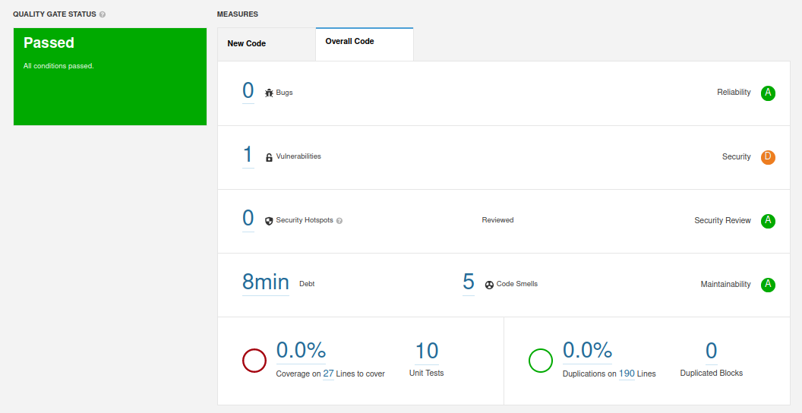

## token

sqp_af2233f71bfc82eb0ca5229ee74f237698a874fe

## results

## technical debt
The technical debt is 8 minutes. This means that an estimated 8 minutes is requiered to solve the identified problems

## issues

| Issue | Problem Description | How to Solve |
|---|---|---|
| Vulnerability | Persistent entities should not be used as arguments of "@RequestMapping" methods | Replace this persistent entity with a simple POJO or DTO object.  |

## coverage

CarDTO.java has no line coverage